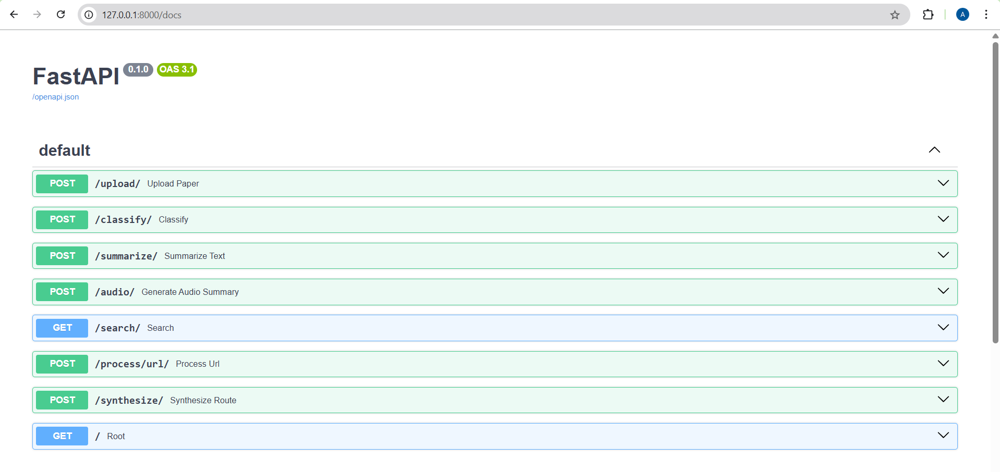
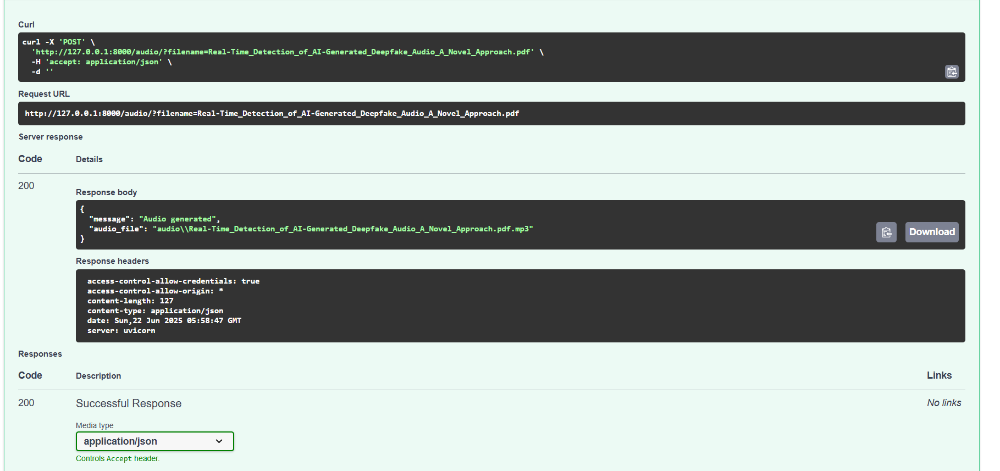
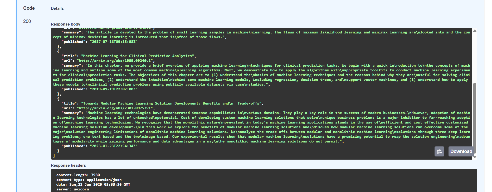
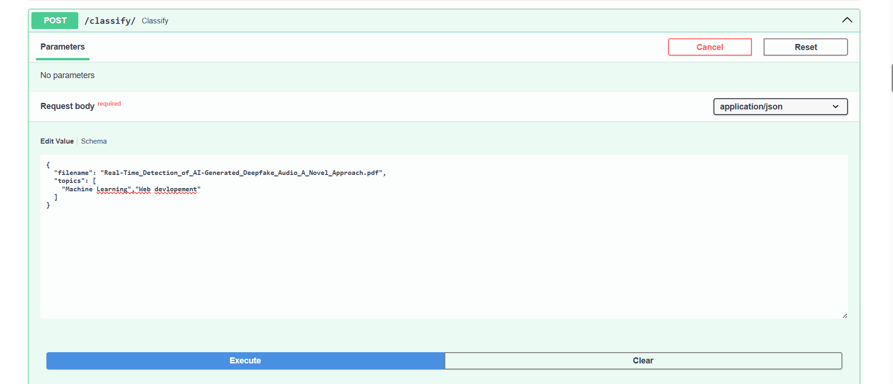

# Research Paper Summarization  
A multi-agent system that can find, analyze, and summarize research papers from various 
sources, organize them by topic, and generate audio podcasts discussing the findings..

---

# Overview
I built a FastAPI‑powered, modular backend that serves as the core of an interactive research assistant. The system allows users to upload academic papers in PDF format, automatically extract their key research topics, and generate long‑form summaries using DeepSeek. It can also synthesize multiple summaries into a single cohesive overview and convert these summaries into audio podcasts with gTTS. In addition, the service integrates with the arXiv API to search for related research papers. Designed with an API‑first approach, it is optimized for seamless integration with a modern, interactive frontend.
---

# Focus Areas

- 🧱 Modular architecture with isolated agents
- 🚀 API-first development with FastAPI
- 📆 Clear separation: upload, summarize, audio, classify, search, synthesize
- 🧠 LLM (DeepSeek via OpenRouter) integration or Higging Face Facebook-Bert Model 

---

# Technology Stack 

Backend Framework – FastAPI
🚀 Why: Lightning‑fast, async‑ready, and integrates seamlessly with OpenAPI for auto‑docs.

Summarization Engine – DeepSeek (via OpenRouter)
🧠 Why: Harnesses a cutting‑edge LLM to produce rich, context‑aware research summaries.

Audio Generation – gTTS (Google Text‑to‑Speech)
🎧 Why: Lightweight, reliable, and perfect for turning summaries into on‑the‑go audio podcasts.

PDF Parsing – PyMuPDF
📄 Why: Efficient, accurate, and quick for extracting text from academic papers.

Deployment – Render
☁️ Why: Enables simple, quick cloud deployment with minimal setup.

Additional Summarization – Facebook BERT Model
⚡ Why: Provides a fast, key‑point summarization option that works without API‑key configuration.
---

## Structure

```
.
├── main.py                  
├── requirements.txt         
├── agents/                  
│   ├── Processor.py
│   ├── Classification.py
│   ├── Summarizer.py
│   ├── Podcast.py
│   ├── Search.py
│   └── Synthesis.py
├── uploads/                 
├── audio/                   
```
## Setup

### Local 

```bash
# Step 1: Install Python deps
pip install -r requirements.txt

# Step 2: Run the FastAPI app
uvicorn main:app --reload
```

Visit: [http://127.0.0.1:8000/docs](http://127.0.0.1:8000/docs)

---
wait for sometimes it may show error but for sometimes but start automatically due to high weight models being used .

# Snippets








